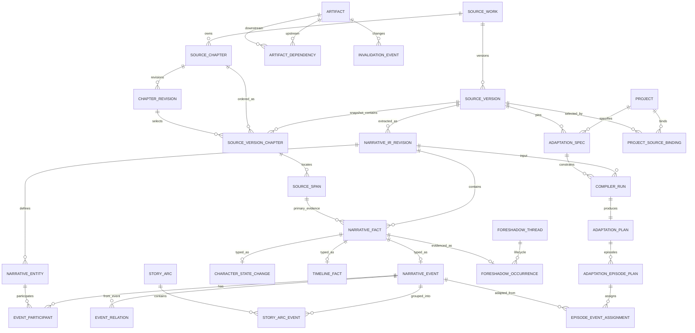

# ADR-001：以 Narrative IR 和 Adaptation Spec 构建改编编译器

- 状态：提议（Phase 0，等待确认）
- 日期：2026-07-21
- 决策者：项目维护者确认后生效
- 适用范围：`drama` schema、CMS API/前端、n8n 00～12 工作流及媒体产物

## 背景

当前系统以 `projects` 为根：`novels`、章节、chunk、故事圣经和后续制作产物均直接或间接依附 `project_id`。这种结构适合“一次导入对应一个项目”的流水线，但无法稳定表达一部原著的多个版本、多个改编项目、章节修订后的精确影响范围，也无法把模型生成的事实与原文位置建立可验证的关系。

现有 `episode_outlines.source_chapter_ids/source_chunk_ids` 提供了粗粒度来源，但人物、事件、时间线和伏笔主要存放在 JSONB 中，缺少规范化身份、精确证据、置信度与因果/时间关系。04 工作流因而是在故事圣经和 chunk 摘要上直接生成大纲，不是一个以事实和约束为输入、可验证且可增量重编译的编译器。

## 决策

采用以下分层架构，并以版本化、不可变快照作为层间边界：

1. 原著资料库：`source_work -> source_version -> version_chapter -> chapter_revision -> source_span`。
2. Narrative IR：从一个已发布的 `source_version` 提取实体和有证据的叙事事实；每条事实必须有精确原文 span 和置信度。
3. Adaptation Spec：把来源版本、改编范围、平台/受众/时长和硬/软规则固化为可版本化输入。
4. 改编编译器：选择 IR 事件，求解约束，生成可验证的分集计划和事件分配；04 保留为兼容入口。
5. 产物图：大纲、剧本、分镜、图片、视频、音频、时间线、母版、QC 与发布物料注册为版本化 artifact，并记录精确上游依赖。
6. 增量失效：章节修订先产生新 `source_version`，再对比 IR 的语义事实；只沿发生改变的事实/规则所连接的依赖边传播 stale，不以整章命中或向量相似度直接判定事实影响。

旧表和旧入口在迁移期保留。新链路采用 dual-write/compatibility projection；任何旧表或字段的删除都不属于本 ADR 的实施阶段，必须另行决策。

## 目标实体关系



### 原著资料库契约

- `source_works` 是与项目无关的作品身份；不按全文 hash 自动跨作品合并，避免把不同版权/版本上下文错误合并。
- `source_versions` 是作品的不可变快照，具有 `version_number`、`parent_source_version_id`、`version_hash` 和 `draft/published/superseded` 状态。只有 `published` 版本可作为正式 IR/改编输入。
- `source_chapters` 是作品内稳定的逻辑章节身份。
- `chapter_revisions` 保存正文修订；`source_version_chapters` 选择一个 revision 并定义该版本中的章节顺序。发布后禁止原地修改，修改通过新版本/新 revision 完成。
- `source_spans` 同时保存 `source_version_id`、`chapter_id`、`chapter_revision_id`，位置使用规范化 UTF-8 正文上的 0-based、右开区间，并记录 UTF-8 byte offset、Unicode code point offset、段落号、证据片段 hash。所有生产者必须使用同一套换行与 Unicode 规范化规则。
- 整本拆章、逐章新增、批量导入都写入 `source_import_jobs/source_import_items`，每个 item 独立 checkpoint、错误与重试次数。批量失败不回滚已确认成功的 item；重试使用相同 idempotency key。

### Narrative IR 契约

- `narrative_ir_revisions` 固定绑定一个 `source_version` 和提取器/Schema 版本。
- `narrative_entities` 和 `narrative_facts` 保存跨 IR revision 的稳定逻辑身份；`narrative_entity_revisions`、`narrative_fact_revisions` 保存某次 IR 快照中的具体值。别名与 mention 分表，实体 mention 必须指向 `source_span`。
- `narrative_fact_revisions` 是事实修订超表，至少包含 `fact_kind`、`source_version_id`、`chapter_id`、`primary_source_span_id`、`confidence`、`canonical_fingerprint`、`validation_status`。复合外键保证 primary span 属于同一版本和章节。
- `narrative_event_revisions`、`character_state_changes`、`timeline_facts`、`foreshadow_occurrences` 以 1:1 typed row 扩展事实修订；`event_participants` 明确参与者与角色；`event_relations` 明确 before/after/causes/enables/blocks 等关系。编译器引用具体 event revision，同时保留逻辑 event/fact ID 用于跨 source version 对比。
- `foreshadow_threads + foreshadow_occurrences` 表达 planted/reinforced/partially_resolved/resolved/abandoned 生命周期；`story_arcs + story_arc_events` 表达事件集合与顺序。
- 除 primary evidence 外，`fact_evidence` 可记录 supporting/conflicting evidence。置信度只表示提取可信度，不能替代来源和业务校验。
- 向量只允许用于候选召回，不允许用于确认证据、时间顺序、因果关系或失效传播。

### Adaptation Spec 契约

`adaptation_specs` 是 append-only 版本，至少包含：

- `project_id`、`source_version_id`、`narrative_ir_revision_id`；
- 范围：章节集合/区间和故事弧集合，二者交集/并集策略必须显式；
- `platform`、`audience_profile`、`target_episode_count`、`episode_duration_seconds`；
- `ruleset_version`、状态与 spec hash。

`adaptation_rules` 使用受控类型：`must_preserve`、`merge_allowed`、`must_not_change`、`omit_allowed`、`transform_required`。每条规则有目标类型/ID、hard/soft、优先级、参数和理由。硬规则未满足时编译失败，不能靠模型补写绕过。

### 编译器契约

编译过程是可重试状态机，而不是一次大模型调用：

1. 冻结 `source_version + IR revision + spec version`。
2. 依据范围和规则选择候选事件；按章节/故事弧窗口分页读取，不装载整本正文。
3. 校验事件参与者、时间顺序、因果边、伏笔生命周期和硬规则。
4. 生成 `adaptation_plan`、`adaptation_episode_plans` 与逐事件 `episode_event_assignments`。
5. 运行结构、时长、覆盖率、连续性和规则验证；失败结果保留 diagnostics，不发布 plan。
6. 通过 compatibility projector 写入现有 `seasons/episode_outlines`，并在新增 nullable FK 中记录 spec、compiler run 和 plan 来源。

AI 响应必须先通过版本化 JSON Schema，再通过引用完整性、范围、时间线、因果、时长和规则等业务校验，最后才能在同一数据库事务中发布。数据库不保存供应商响应正文，只保存经过 allowlist 的 usage、request ID、模型/提示模板版本、验证结果和内容 hash。

## Phase 1 候选物理公共契约

下表是 Phase 1 需要落成并冻结的最小公共结构；列名、FK、枚举和索引仍须在 Phase 1 migration review 中逐项确认，当前文档不代表数据库已经存在这些表。

| 分组 | 表 | 关键身份与约束 |
|---|---|---|
| Source | `source_works` | `work_id`；独立于 project，soft lifecycle status |
| Source | `source_versions` | `source_version_id`，`(work_id,version_number)` unique，parent FK；published 后不可变 |
| Source | `source_chapters` | `chapter_id`，属于 work 的稳定逻辑身份 |
| Source | `chapter_revisions` | `chapter_revision_id`，`(chapter_id,revision_number)` unique，正文 hash |
| Source | `source_version_chapters` | `(source_version_id,chapter_id)` 与 `(source_version_id,ordinal)` unique，选择具体 revision |
| Source | `source_spans` | span + version/chapter/revision 复合一致性；byte/codepoint 右开 offset 与 quote hash |
| Import | `source_import_jobs/items` | operation/idempotency、item checkpoint、lease、retry、sanitized error |
| Binding | `project_source_bindings` | project/source version/role；一个 project 只有一个 current primary binding |
| Legacy | `legacy_source_bindings` | legacy novel/chapter 与新 source 身份的确定性 mapping、migration batch |
| IR | `narrative_ir_revisions` | source version + extractor/schema version + input hash 唯一发布快照 |
| IR | `narrative_entities/entity_revisions/entity_aliases/entity_mentions` | 逻辑身份与快照值分离；mention 有 source span/confidence |
| IR | `narrative_facts/fact_revisions/fact_evidence` | 逻辑事实、版本事实、primary/supporting/conflicting 证据 |
| IR | `narrative_event_revisions/event_participants/event_relations` | 事件 typed fact、参与者、时间/因果有向边 |
| IR | `character_state_changes/timeline_facts` | typed fact，状态 before/after 与受控时间语义 |
| IR | `foreshadow_threads/foreshadow_occurrences` | lifecycle 状态机与事件/证据 |
| IR | `story_arcs/story_arc_revisions/story_arc_events` | arc 版本、成员事件 revision 与顺序 |
| Spec | `adaptation_specs/adaptation_rules/adaptation_scope_chapters/adaptation_scope_arcs` | append-only spec version、受控规则类型与 normalized scope |
| Compiler | `compiler_runs/compiler_checkpoints/compiler_diagnostics` | exact IR/spec input、lease、input hash、validator result |
| Plan | `adaptation_plans/adaptation_episode_plans/episode_event_assignments` | run 输出、episode 顺序、event revision 使用方式/合并组 |
| Lineage | `artifacts/artifact_dependencies/artifact_source_evidence` | exact revision + content hash；上游/下游都用 artifact FK |
| Operations | `operations` + claim/heartbeat functions | 统一 operation/trace、checkpoint、claim token、heartbeat、过期租约接管 |
| Invalidation | `invalidation_tasks/invalidation_impacts` | change set、传播原因、before/after validity、rebuild operation |
| Migration | `schema_migrations/migration_audit` | version/checksum/批次/开始完成状态；runner 使用 advisory lock |

旧 `projects`、`novels`、`novel_chapters`、`novel_chunks`、`story_bibles` 和所有下游表继续存在。Phase 1 只 additive 增加 mapping/nullable lineage 列；新 normalized 表是新链路真相来源，旧 JSONB source ID 数组由 projector 生成。

### 产物依赖与精确失效

- `artifacts` 为所有 source revision、IR fact、spec、plan、outline、script、scene、storyboard、shot、media、timeline、master、QC 和 publication metadata 提供统一身份、版本、内容 hash 与 `valid/stale/rebuilding/superseded/failed/needs_review` 状态。
- `artifact_dependencies` 保存 `upstream_artifact_id -> downstream_artifact_id`、依赖种类、使用的上游 hash 和可审计 selector。旧 `source_*_ids` JSONB 继续保留展示和兼容，但不再是失效判断的真相来源。
- 原著修改创建新版本；项目在显式 rebase 到新版本前仍固定使用旧版本，不被隐式污染。
- rebase 时先按 chapter revision hash 找出 changed/added/removed chapters，再重提取相关章节及必要边界窗口。相同语义 fingerprint 且验证通过的事实保持逻辑身份；span 纯位移只更新证据，不传播语义 stale。
- 只有 changed/removed facts、changed rules 或计划选择变化产生 invalidation event，并沿显式依赖边传播。无法确定是否同一事实时标记 `needs_review`，不得假装精确，也不得全项目无差别作废。
- 失效只改变派生状态，不删除历史产物；重编译成功后产生新 artifact revision，旧 revision 仍可审计和回滚。

## 公共标识与并发规则

- API 和工作流只暴露不透明 TEXT ID；逻辑实体 ID 与 revision ID 分离。
- 所有 command 接受 `Idempotency-Key`；唯一键以资源/操作/输入版本为组成部分，不以一次执行随机 ID 代替业务幂等。
- 修改 draft 资源使用 `If-Match`/`expected_revision` 防止丢失更新；published source/IR 与 active Spec 只允许转为 superseded，其内容和组成子记录不可原地修改。
- 长任务返回 `202 {operation_id,status}`，通过查询接口读取 checkpoint；重试同一 operation 不创建重复业务实体。
- 用户/orchestrator command 不携带 worker lease；worker claim 后使用独立 execution envelope。所有 checkpoint、fail、complete 和领域结果发布必须在同一事务用当前 `claim_token` 锁定 operation，stale worker 不得提交。
- 公共 envelope 带 `contract_version`、`trace_id`、`operation_id`、`status`、sanitized `error`，不向 CMS 返回供应商原始响应。

## API 演进决策

保留现有 `/api/v1/projects`、project action、review、media 和 AI config 路由。新增 `/api/v2`：

- `POST/GET /source-works`
- `POST/GET /source-works/{work_id}/versions`
- `POST /source-versions/{version_id}/imports`
- `POST /source-versions/{version_id}/chapters`
- `POST /source-versions/{version_id}/chapters:batch`
- `PATCH /source-versions/{version_id}/chapters/{chapter_id}`（仅 draft，创建 revision）
- `POST /source-versions/{version_id}:publish`
- `POST /adaptation-projects`
- `POST/GET /adaptation-projects/{project_id}/specs`
- `POST /adaptation-projects/{project_id}/compiler-runs`
- `GET /operations/{operation_id}`
- `POST /operations:claim`（内部 worker）
- `POST /operations/{operation_id}:heartbeat`（内部 worker）
- `POST /operations/{operation_id}:checkpoint`（内部 worker）
- `POST /operations/{operation_id}:finish`（内部 worker）
- `GET /artifacts/{artifact_id}/lineage`
- `GET /adaptation-projects/{project_id}/impact`

新建改编项目的核心请求为：

```json
{
  "display_name": "示例改编 A",
  "adaptation_spec": {
    "schema_version": "adaptation-spec.v1",
    "source_version_id": "sv_...",
    "ir_revision_id": "ir_...",
    "scope": {"mode": "chapters_only", "chapter_ids": ["ch_..."], "story_arc_revision_ids": []},
    "platform": "抖音",
    "audience_profile": {"age_band": "18-35", "preferences": ["强情节"]},
    "target_episode_count": 12,
    "episode_duration_seconds": 90,
    "rules": [{"rule_type":"must_preserve","enforcement":"hard","target_type":"event","target_id":"event_revision_...","priority":100,"parameters":{}}]
  }
}
```

旧 `POST /api/v1/projects` 请求/响应暂不破坏。compatibility facade 将一次旧请求翻译为“创建 source work/version、导入、创建默认 spec、创建 project、运行旧编排”，继续返回 `project_id` 和经脱敏的兼容响应。不能同时提交 `novel_text` 与 `source_version_id` 的 v2 请求。

## 备选方案与否决原因

- 继续扩展 `story_bibles` JSONB：无法建立强来源约束、事实级依赖和精确失效。
- 直接把 `novels.project_id` 改 nullable 或删除：会破坏现有查询、级联关系和工作流，不符合 additive-first。
- 用 embedding 相似度推断事实延续：适合召回，不足以证明来源、时间线或因果一致性。
- 每次章节修改全量重跑：实现简单但成本高、无法满足“只标记真正受影响内容”。
- 整本正文一次请求生成 IR/分集：超出上下文与重试边界，也无法可靠做章节级 checkpoint。

## 后果

正面结果是原著可复用、改编输入可冻结、事实可追溯、编译可验证、派生可增量失效。代价是表数量和状态机复杂度上升，需要稳定 ID、schema registry、依赖图、rebase/impact 逻辑与兼容投影；因此必须先在 Phase 1 冻结公共数据库/API/JSON Schema 契约，之后才允许按明确文件所有权并行开发。

## 不变量

1. 不删除、重置 AI 配置、n8n 工作流或 Credential。
2. 新迁移只 additive-first；迁移期不 DROP 旧表/字段。
3. 已发布 source version、IR revision、spec 和 artifact revision 不原地覆盖。
4. 每条 Narrative IR 事实都有 source version、chapter、精确 span、置信度。
5. AI 输出通过 JSON Schema 和业务校验前不得写入正式事实/计划表。
6. 正确性校验不以向量相似度作为证据。
7. 单次模型请求只处理有上限的章节/事件窗口。
8. 供应商响应原文、密钥和数据库密码不得进入仓库或业务响应。
