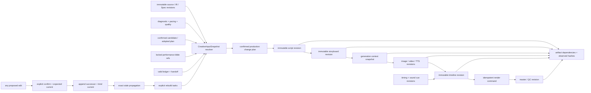

# 创作链闭环架构审计

审计日期：2026-07-31

审计范围：Narrative IR、Adaptation Spec、诊断、节奏、候选、剧本、分镜、表演圣经、连续性、时间线，以及它们在数据库、CMS 和 n8n 工作流中的实际读写关系。

状态：可执行基线；只记录现状和约束，不代表已经完成闭环改造。

> 2026-07-31 实施注记：本审计第 6 节和 P0-2 记录的单集内容直接 PATCH/原地 UPDATE 旁路，已由 migration 19 和统一 change-plan executor 关闭。`EpisodeContentModal`、局部精修、统一创作工作台以及场景、对白、镜头、视频片段、时间线编辑现在统一执行“预览 → 确认 → successor 版本 → current 切换 → 精确失效 → pending 重建”；本文件其余“当前”表述保留为改造前审计快照。

## 1. 审计边界与方法

本次审计遵守以下边界：

- 只分析、补充架构文档、运行只读或静态验证。
- 不修改业务逻辑，不部署，不执行真实生成，不讨论运维、权限或商业闭环。
- 保留工作区中已有的未提交修改；没有执行 `reset`、`checkout`、清理或覆盖。
- 继续采用 additive-first、不可变版本、精确 lineage、显式确认、旧版本可恢复原则。
- `deterministic_mock`、fixture、固定规则和 provider Mock 只证明数据结构或流程可运行，不代表真实创作、媒体生成或质量检测成功。

按要求先检查了仓库约束。工作区及 `ai-short-drama` 仓库内没有找到 `AGENTS.md`；因此本审计以根 `README.md`、`cms/README.md`、`docs/architecture/*`、`database/02..17`、CMS 前后端和 `workflows/00..17` 为现行依据。该缺失本身应在下一阶段开始前解决，避免文件所有权和迁移规则只存在于口头约定。

证据等级：

- **运行读取**：生产代码或工作流 SQL 明确查询该实体。
- **运行写入**：生产代码或工作流明确写入该实体。
- **展示读取**：只由 CMS 聚合/展示读取，不会改变下游生成输入。
- **fixture-only**：只有测试夹具、验收 SQL 或测试代码写入。
- **schema-only**：只有表、字段、约束或文档，没有运行读写。

## 2. 总体结论

当前系统不是一条闭合的创作链，而是“一条主生产链 + 三个旁路岛”：

1. 主生产链在 `Narrative IR -> Adaptation Spec -> compiler plan` 之间有较强的不可变版本和来源证据。
2. `AdoptAdaptationPlan` 把计划投影回 legacy `episode_outlines` 后，05–12 继续按正式业务表、状态和局部 `version/is_current` 字段运行；统一 artifact graph 和精确 lineage 没有继续向剧本、分镜、媒体、时间线传播。
3. 诊断/节奏/候选形成分析与选择岛；候选选择虽写入 `artifact_current_bindings`，但没有下游生产读取该 binding。
4. 表演圣经/连续性形成门禁岛；16 工作流能够读取并记录生成上下文，但 05–10 没有调用它，也没有生产路径写入所需引用。
5. 后期工作台形成编辑岛；模板、声音和恢复会创建新时间线版本，但现有渲染链只渲染 11 工作流自己新建的时间线，工作台产生的 current 时间线没有对应 render/rebuild 闭环。

因此 README 中“候选 current 可被下游默认读取”“生成门禁要求剧本、分镜、图像、视频与 TTS 引用表演圣经并读取连续性”“统一工作台形成完整处理面”等表述，属于目标设计或静态能力描述，不能作为当前运行读取关系的证明。对应声明见 `README.md:24-40`；实际反证见下文。

## 3. 当前实际数据流

```mermaid
flowchart LR
  Source["source_versions"] --> IR["Narrative IR revisions"]
  IR --> Spec["Adaptation Spec version"]
  IR --> Compiler["04a deterministic compiler"]
  Spec --> Compiler
  Compiler --> Plan["adaptation_plan / episode plans"]
  Plan --> Adopt["AdoptAdaptationPlan"]
  Adopt --> Outline["legacy episode_outlines"]
  Outline --> W05["05 episode script"]
  W05 --> Script["episode_scripts / scenes / dialogues"]
  Script --> W06["06 storyboard"]
  W06 --> Board["storyboards / shots"]
  Board --> Media["07–10 visual / video / TTS / audio plan"]
  Media --> W11["11 compose"]
  W11 --> Timeline["edit_timeline + render_job"]
  Timeline --> Master["worker / QC / master"]

  IR --> Analysis["diagnostic / pacing / quality"]
  Spec --> Analysis
  Analysis --> Candidates["candidate sets / candidates"]
  Candidates --> Selection["candidate selection + current binding"]
  Selection -. "无 05–11 运行读取" .-> W05

  Bible["performance bible"]
  Ledger["continuity ledger / handoff"]
  Bible --> Gate16["16 context gate"]
  Ledger --> Gate16
  Gate16 --> ContextRead["generation_context_reads"]
  ContextRead -. "未接入 05–10" .-> Media

  Board --> W17["17 deterministic sound formalization"]
  W17 --> Workbench["sound/timing/template/timeline versions"]
  Analysis --> Workbench
  Selection --> Workbench
  Bible --> Workbench
  Ledger --> Workbench
  Workbench -. "current timeline 无 render_job" .-> Master
```

实线表示运行路径中的实际读取/写入；虚线表示设计上应连接但当前没有运行消费或物化动作。

## 4. 模块读取矩阵

| 模块 | 主要运行写入 | 实际运行读取者 | 当前判断 |
|---|---|---|---|
| Narrative IR | `narrative_ir_revisions`、事件/实体/关系/状态/伏笔、`timeline_facts` | Adaptation Spec、分析器、compiler、rolling projection | IR 主体已消费；`timeline_facts` 只有 02b 写入，没有非测试下游读取 |
| Adaptation Spec | `adaptation_spec_versions`、规则、范围 | 分析器、compiler、rolling production | 在计划生成前有效；05 以后不再直接读取 |
| 诊断 | `adaptation_diagnostic_reports`、issues | CMS、创作工作台 | 不进入 05–11 生成输入；候选生成不直接读诊断报告 |
| 节奏 | `pacing_plan_versions`、beats | CMS、创作工作台 | 不进入 05–11；只是展示/编辑输入 |
| 质量评分 | `quality_score_reports`、dimensions/issues | 候选生成、CMS、创作工作台 | 是候选的基线依赖，但不直接约束正式剧本/分镜 |
| 候选 | candidate set/candidate/score/selection + artifact binding | 候选工作台、创作工作台 | 选择结果没有被 05–11 或 rolling production 读取，未物化为正式内容 |
| 改编计划 | plan/episode plan/assignments + artifact/dependency/evidence | rolling production、分析器、impact | 统一 artifact graph 的最后一个完整生产节点 |
| 剧本 | `episode_scripts`、`script_scenes`、`dialogues` | 06、08–11、CMS | 由 legacy 表驱动；未写 core artifact/dependency；计划 lineage 字段未被生产写入 |
| 分镜 | `storyboards`、`storyboard_shots` | 08–11、CMS | 依赖 `script_id`，但没有统一 artifact lineage，也不读取表演/连续性门禁 |
| 表演圣经 | `character_performance_bibles` | CMS、创作工作台、独立 16 工作流 | `artifact_performance_bible_refs` 没有生产写入者，无法证明实际生成使用了哪一版 |
| 连续性 | ledger、handoff | CMS、创作工作台、独立 16 工作流 | 没有集成到 05–10；现有 gate 是旁路 |
| 生成上下文 | `generation_context_reads` | 16 自身和 schema 关联 | 05–10 不写 `generation_context_read_id`，没有形成生成审计闭环 |
| 对白 timing | `dialogue_timing_versions/issues` | 创作工作台 | 固定规则校验结果；11 不读取 |
| 正式声音 | sound asset/version/cue | 创作工作台、声音替换 | 10/11 不读取 phase 17 sound cue；17 默认写入 deterministic Mock 资产 |
| 时间线 | `edit_timelines/items` | 创作工作台、11、worker | 11 创建时间线和 render job；工作台克隆的新 current 时间线不创建 render job |
| 创作工作区快照 | `creative_workspace_versions` | 创作工作台 GET | 没有生产写入者；当前是 fixture/schema 占位 |

### 4.1 IR、Spec 到计划的真实关系

- `workflows/04a-adaptation-compiler.json:169` 在一次事务中验证 IR 事件、Spec 硬规则、时长、因果、伏笔和来源章节，并写 plan、episode plan、artifact、dependency 与 source evidence。
- `cms/backend/internal/store/rolling_production.go:314-356` 把 episode plan 投影成 `episode_outlines`，保留 `adaptation_episode_plan_id` 和 `source_ir_revision_id`，并把事件摘要投影到 `plot_points`。
- 同一投影把 `source_chunk_ids` 固定写成空数组，见 `rolling_production.go:316-322`。
- 05 的输入仍通过 `episode_outlines.source_chunk_ids` 回查 `novel_chunks`，见 `workflows/05-episode-script.json:10`。因此从 v2 plan 进入 05 时，IR 的精确章节/事件结构只剩摘要投影，原 chunk 摘要输入为空。
- 计划采用只更新 native `adaptation_plans.status/is_current`，见 `rolling_production.go:378-382`；没有同步更新 compiler 创建的 plan artifact 的 `validity_status/is_current`。native current 与 artifact current 会发生分叉。

### 4.2 剧本与分镜的真实读取

- 05 读取 approved `episode_outlines`、legacy `story_bibles`、前后集 outline 和 `source_chunk_ids` 对应的 `novel_chunks`，见 `workflows/05-episode-script.json:10`。
- 05 不读取 IR、Spec、诊断、节奏、候选 binding、表演圣经或连续性账本。
- `database/06-narrative-ir-foundation.sql:1150,1186-1187` 给 `episode_scripts` 增加了 `source_adaptation_episode_plan_id`，但生产代码和工作流没有写入该字段。
- 06 只读取 approved script、scene/dialogue 与 legacy story bible，见 `workflows/06-storyboard-design.json:10`。
- 06 保存 storyboard/shots 时直接写 native 表和 review/usage/task 状态，见 `workflows/06-storyboard-design.json:17`；没有写 `artifacts` 或 `artifact_dependencies`。
- 对 `workflows/05..11` 的静态检索没有发现 `artifacts`、`artifact_dependencies`、`artifact_current_bindings`、`artifact_performance_bible_refs`、`generation_context_reads`、`sound_cue_versions` 或 `dialogue_timing_versions` 的读取/写入。

### 4.3 媒体、表演圣经与连续性

- 08 读取 approved storyboard、锁定 visual profiles 和当前图片，见 `workflows/08-storyboard-images.json:151`。
- 09 从 approved script/storyboard/current image 出发，见 `workflows/09-image-to-video.json:316`。
- 10 从 latest approved script、dialogue、voice profile 和 current audio 出发，并从 storyboard hints 重建 `episode_audio_plans`，见 `workflows/10-voice-audio.json:92,199`。
- 16 能查询 `artifact_performance_bible_refs`、有效 ledger 和 handoff，并写 `generation_context_reads`，见 `workflows/16-performance-continuity-qc.json:43,74`。
- 但 `artifact_performance_bible_refs` 没有生产写入者；测试夹具之外没有建立 script/storyboard/image/video/TTS 到圣经版本的引用。
- `storyboard_images`、`shot_videos`、`dialogue_audio` 虽有 `generation_context_read_id` 字段（`database/16-performance-continuity-visual-qc.sql:215-217`），05–10 没有赋值。
- 视觉 QC 的运行 API 是 `run-fixture`，保存 provider 为 `deterministic_mock`，见 `cms/backend/internal/httpapi/performance_continuity.go:31,136` 和 `store/performance_continuity.go:321-335`。它不是实际帧分析 provider。

### 4.4 时间线与后期工作台

- 11 从 approved outline/script/storyboard、current video/audio/subtitle 和 `episode_audio_plans` 构建全新 timeline，见 `workflows/11-edit-compose.json:56`。
- 11 同一次写入 timeline、timeline items 和 render job，见 `workflows/11-edit-compose.json:110`。
- 创作工作台的模板切换、恢复和声音替换会 clone 新 timeline 并设置 current，见 `cms/backend/internal/store/postproduction.go:216-283,310-340,405-470,500-550`。
- 这些 clone 路径没有写 `render_jobs`、rebuild task、artifact dependency 或 provenance；11 也不会读取 current timeline 后重新物化，而是再次从正式媒体重建。因此“已切换模板/声音/恢复时间线”不等于“该版本已进入渲染”。
- 17 从 storyboard 的 `bgm_hint/sound_effect_hint` 合成 sound asset/cue，固定 `source_kind='deterministic_mock'`、时长和 license metadata，见 `workflows/17-post-production-creative-workbench.json:54`。这不是实际音频文件生成成功。
- 对白 timing 保存使用固定规则结果；缺省 analyzer 标记为 `deterministic-lipsync-v1`，见 `postproduction.go:585-655`。11 不读取这些 timing 版本。

### 4.5 创作工作台不是一致性快照

`GetCreativeWorkbench` 是即时聚合，不是冻结输入：

- 诊断取项目最新 completed；节奏取该集所有 published beat；候选取该集所有 candidate，并不解析 confirmed selection/current binding，见 `postproduction.go:109-123`。
- scenes、dialogues、shots 只按 project/episode 查询，没有限定 latest approved script/storyboard，见 `postproduction.go:124-133`。存在多个历史版本时可能混合聚合。
- 表演圣经取项目所有 approved/locked 版本，连续性取该集全部 entries，见 `postproduction.go:148-152`。
- `creative_workspace_versions` 只在 GET 中读取，见 `postproduction.go:174-175`；没有生产写入，所以不能证明页面上各块数据共享同一 source/spec/plan/script/storyboard 版本。

## 5. 只保存、没有被下游消费的能力

| 保存点 | 保存成功的事实 | 缺失的下游消费 |
|---|---|---|
| `artifact_current_bindings` | candidate selection 成为 current，旧 artifact superseded | 除 `v2_candidates.go` 自己读取旧 binding 外，生产链没有 selector |
| diagnostic report | 有 completed 诊断及 artifact | 05–11 不读；只在 CMS 展示 |
| pacing plan/beats | 有 published 节奏版本 | 05–11 不读；只在 CMS 展示 |
| `timeline_facts` | 02b 能写时间线事实 | 没有非测试运行读取 |
| `source_adaptation_episode_plan_id` | schema 可表达 script 精确来源 | 生产路径从不填充 |
| `artifact_performance_bible_refs` | schema 可表达生成物所读圣经版本 | 没有生产写入者 |
| `generation_context_reads` | 16 可记录一次 gate 解析 | 05–10 不调用；媒体行不引用 |
| `dialogue_timing_versions` | 保存规则校验版本 | 11 compose 不读取 |
| `sound_cue_versions` | 保存正式 cue 版本 | 10/11 仍使用 `episode_audio_plans` 和 storyboard hints |
| 工作台 clone 的 current timeline | 保留父版本且可恢复 | 没有 render job/rebuild |
| `creative_workspace_versions` | schema/fixture 可保存工作区快照 | 无生产写入 |
| `quality_issue_edit_links` | schema/fixture 可链接问题和编辑 | 无生产写入 |
| `artifact_provenance_events` | schema/fixture 可记录来源事件 | 无生产写入 |

特别说明：这里的“没有消费”是对当前仓库生产代码和工作流的静态结论，不等于表不存在，也不等于 fixture 无法写入。

## 6. 绕过版本/change plan/失效传播的正式写入

### 6.1 明确的 P0 绕过

项目详情中的单集内容编辑链路：

`ProjectDetailView -> EpisodeContentModal -> api.updateEpisodeContent -> PATCH /episode-runs/:id/content -> Store.UpdateEpisodeContent`

证据：

- 前端发起 PATCH：`cms/frontend/src/components/EpisodeContentModal.vue:79`、`cms/frontend/src/services/api.js:51-55`。
- handler 直接解析 body 并调用 store；没有 `Idempotency-Key`、expected revision/`If-Match`、change plan 或 confirm token，见 `cms/backend/internal/httpapi/episode_content.go:28-49`。
- store 原地 UPDATE `episode_outlines`，见 `cms/backend/internal/store/episode_content.go:268-275`。
- store 原地 UPDATE `script_scenes`、`dialogues`、`episode_scripts`，见 `episode_content.go:367-430`。
- UI 明示下游不会自动重做，见 `EpisodeContentModal.vue:147`。

该入口只检查 active workflow task 和基本内容校验；它不创建 immutable successor、不记录 unified artifact/dependency、不生成 change plan、不传播 stale、不建立 rebuild task。旧正式内容无法通过该入口的 native 版本恢复。这是当前最直接的闭环破坏点。

### 6.2 有保护但尚未统一的写入

| 写入面 | 已有保护 | 仍缺失 |
|---|---|---|
| Local Editing Workbench | plan -> 显式 confirm -> `entity_versions` 快照 -> 精确 stale/rebuild | native 业务行仍原地修改；历史恢复依赖旁表快照，不是物理不可变行 |
| 媒体替换/重生 | successor generation version、old current 保留为历史 | 没有统一 artifact graph/current binding/影响计划 |
| 模板切换/声音替换/时间线恢复 | 创建 successor timeline/cue，保留 parent | 单次 POST 即提交；没有独立 plan/confirm、expected current、artifact invalidation、render rebuild |
| 对白 timing 校验 | 创建 timing successor | 规则结果未进入 compose 输入，也没有 artifact/provenance/rebuild |
| review/lock | 只修改审核或锁定状态 | 状态 current 与统一 artifact current 仍可能分叉 |

## 7. Mock、固定规则和占位实现

### 7.1 明确 deterministic Mock

- 诊断/节奏/评分：`cms/backend/internal/adaptationanalysis/model.go:3` 固定 `AnalyzerVersion = deterministic-mock-v1`；`analyzer.go` 使用正则、关键词计数、阈值和固定计分。
- 诊断 API 当前只允许 `deterministic_mock`，见 `cms/backend/internal/httpapi/v2_source.go:119-120`。
- 候选：`candidategeneration/model.go:13,120-137` 只启用 `deterministic_mock`。
- 候选五项硬规则是对候选 JSON 中哨兵字符串的包含检查，例如 `continuity_break`，见 `candidategeneration/model.go:225-227`；并非读取真实 continuity ledger 或 IR 状态图验证。
- local edit 的部分 TTS、视频片段和执行任务显式写 `deterministic_mock`，见 `cms/backend/internal/store/local_edit.go:355-362,604-606,784-834`。
- 17 的 sound asset 是 storyboard hint 的确定性物化，没有实际媒体生成，见 `workflows/17-post-production-creative-workbench.json:54`。
- Visual QC 只有 fixture API，provider 为 `deterministic_mock`。

### 7.2 固定规则引擎

- adaptation compiler 是 `scripts/adaptation-compiler.js` 的确定性编译器。它可验证约束和来源，但不是生成模型。
- local edit planner 通过 `strings.Contains` 和正则解释有限自然语言，见 `cms/backend/internal/localedit/planner.go:196-257`。
- performance/continuity engine 根据输入的 identity/flicker/melt 分数做固定阈值判断，见 `cms/backend/internal/performancecontinuity/engine.go:172-189`；分数本身当前来自 fixture。
- dialogue timing 是固定区间、offset、说话人和时长规则；缺省 analyzer 名为 `deterministic-lipsync-v1`。
- 内置剪辑模板和 sound style 映射是固定配置，不构成自动理解或真实素材生成。

### 7.3 有真实 adapter，但本次没有验证真实成功

07–10 和 12 存在 generic/Google/Vertex 等 provider adapter 分支，同时默认或 test mode 可走 Mock。本次只运行静态/单元测试，没有调用任何 provider、没有生成图片/视频/音频、没有执行 FFmpeg render，也没有发布。因此只能断言“adapter 代码和静态契约存在”，不能断言“真实生成成功”。

### 7.4 schema/fixture 占位

以下能力目前主要由 schema、文档或验收 fixture 支撑：`creative_workspace_versions`、`quality_issue_edit_links`、`artifact_provenance_events`、生产路径中的 `artifact_performance_bible_refs`、媒体的 `generation_context_read_id`。它们不应出现在“已闭环”的验收结论中。

## 8. P0 / P1 / P2 缺口

### P0：不解决就不能声称创作链闭环

| 编号 | 缺口 | 代码证据 | 验收退出条件 |
|---|---|---|---|
| P0-1 | unified lineage 在 plan 后中断 | 只有 04a/17 和少数 Go store 写 artifacts；05–11 无 artifact/dependency；script 来源字段未写 | outline/script/storyboard/media/timeline 每个 current revision 都可反查精确上游 artifact/hash |
| P0-2 | 单集内容页原地 UPDATE 正式表 | `episode_content.go:268-430`；`EpisodeContentModal.vue:147` | 该入口改为 propose/confirm/immutable successor/invalidate/rebuild；旧版本可恢复 |
| P0-3 | confirmed candidate/current binding 是死端 | `v2_candidates.go:514-575`；05–11 无 `artifact_current_bindings` | 正式生成只从统一 resolver 读取已确认 selection；读取被记录进 input snapshot |
| P0-4 | 表演圣经/连续性门禁未接入生成 | 16 独立读写；05–10 无相关表；refs 无生产 writer | script/board/image/video/TTS 生成前解析并冻结 context；缺失或 stale 时阻断 |
| P0-5 | 后期 current timeline 不可渲染闭环 | `postproduction.go:500-550` 只 clone；只有 `11:110` 写 render job | 任一已确认 timeline revision 可幂等 materialize/render，结果精确引用 timeline artifact |

### P1：闭环可运行后必须解决的一致性问题

| 编号 | 缺口 | 代码证据 | 验收退出条件 |
|---|---|---|---|
| P1-1 | native `is_current`、`artifacts.is_current`、binding 表三套 current 语义 | `database/06:997-1007`、`database/14:160`、各 store 独立切换 | 只有一个公共 resolver；兼容字段只作投影并有一致性检查 |
| P1-2 | plan 采用未同步 artifact 状态 | `rolling_production.go:378-382` | 原子发布 plan native revision、artifact validity 和 binding |
| P1-3 | 创作工作台混合读取多个历史版本 | `postproduction.go:109-175` | GET 返回一个 frozen `CreativeInputSnapshot`，所有组件带 exact revision/hash |
| P1-4 | 诊断/节奏只展示，不约束正式生成 | 05–11 无相关读取 | 通过 snapshot 进入候选/剧本计划；允许显式 override 且记录理由 |
| P1-5 | 模板/声音/恢复缺 expected-current、独立确认和失效传播 | `postproduction.go:216-550` | propose 返回 diff/impact；confirm 后产生 successor + invalidation + rebuild |
| P1-6 | 媒体版本化未接统一 artifact graph | 07–10 只用 native generation version/current | 双写 artifact/dependency；旧版本和 current 选择一致 |
| P1-7 | deterministic hard rules 被描述得比实际更强 | `candidategeneration/model.go:225-227` | capability response 显式标 `rule_engine/mock`；真实账本验证另有证据 |

### P2：清理歧义和完成审计面的缺口

| 编号 | 缺口 | 代码证据 | 验收退出条件 |
|---|---|---|---|
| P2-1 | `timeline_facts` 无消费者 | 02b 写入，生产检索无读取 | 接入明确消费者或标记 deprecated，不能静默闲置 |
| P2-2 | workspace/provenance/issue link fixture-only | `postproduction.go:174-175`；migration 17；测试 fixture | 生产 writer 和读取验收存在，或从“已实现”清单移除 |
| P2-3 | README/阶段文档把目标流写成当前流 | `README.md:24-40` 与本审计反证 | 文档区分 implemented / wired / verified-real 三种状态 |
| P2-4 | 仓库缺少 `AGENTS.md` | 工作区检索结果为空 | 冻结文件所有权、迁移规则和测试边界 |
| P2-5 | 静态验证偏重“字符串/节点存在” | `validate-phase13/14/17.js` 等 | 增加消费关系和 negative graph tests，证明 dead-end 不可回归 |

## 9. 目标数据流

目标流的关键不是增加更多表，而是所有 producer 和 consumer 共享同一组公共契约：

1. consumer 只通过 resolver 选择输入；
2. resolver 返回精确 revision、artifact、hash 和 validity；
3. producer 只追加 successor，不覆盖历史内容；
4. current binding 与发布原子切换；
5. 改动必须先给出 change plan 和影响面，再显式确认；
6. 失效和重建使用相同 lineage；
7. 每次运行明确记录 `execution_mode`，Mock 不得伪装为 provider 成功。

## 10. 静态/只读测试基线

审计时执行：

| 命令/测试组 | 结果 | 能证明什么 |
|---|---|---|
| `go test -count=1 ./...` | 通过；11 个有测试 package，2 个无测试 package | Go 单元测试通过；未设置数据库 URL 的 integration tests 不代表 DB E2E |
| `go vet ./...` | 通过，无输出 | 当前 Go 静态检查无报错 |
| `cms/frontend: npm test` | 60/60 通过 | 前端 helper、payload 和展示逻辑通过 |
| 20 个静态 validator/test scripts | 20/20 通过 | schema、workflow JSON、字符串约束和 deterministic compiler fixture 通过 |
| media worker syntax + unit tests | 2/2 通过 | FFmpeg 参数编译规则单元测试通过；没有执行 FFmpeg |
| Veo adapter unit tests | 14/14 通过 | 请求归一化、响应解析、签名和本地 payload 规则通过；没有调用 Vertex |

未执行：

- `run-phase5-acceptance.js`：会创建/删除隔离数据库并写 fixture。
- `validate-workflow-sql.js`：会连接 Docker PostgreSQL 执行 `PREPARE`。
- Phase 3/13/14 DB 脚本及 Go DB integration：会写数据库。
- provider、n8n、FFmpeg、发布或部署验收：不属于本次只读/静态范围。
- `npm run build`：会写构建输出，不是本次只读基线所必需。

结论：当前静态基线全绿，但它只证明现有单元、契约形状和 workflow 静态结构没有失败；不能推翻本审计发现的运行消费断点，也不能证明真实生成成功。

## 11. 下一阶段开始前必须冻结的接口

下一阶段不得先改页面或工作流。必须先冻结以下公共接口，具体字段和文件计划见《创作链闭环分阶段路线图》：

1. `ArtifactRevision`：不可变 revision、native identity、content hash、validity。
2. `CurrentBinding` 与唯一 `ResolveCurrent`：expected binding revision、slot key、原子切换。
3. `CreativeInputSnapshot`：一次生产所读 IR/Spec/plan/diagnostic/pacing/candidate/script/storyboard/performance/continuity/timing/sound/timeline 的精确版本集合。
4. `ProposeChange -> ConfirmChange -> PublishRevision`：diff、影响面、确认 token、expected current、幂等键。
5. `InvalidationAndRebuild`：精确 dependency、observed hash、stale reason、明确 rebuild task。
6. `GenerationContext`：05–10 的统一门禁输入与 `allowed/diagnostics`。
7. `MaterializeTimeline/RenderTimeline`：对一个既存 timeline revision 幂等创建 render job。
8. `CapabilityTruth`：`deterministic_mock | rule_engine | provider` 和可验证输出类型，禁止 Mock 结果冒充真实生成。

只有这些接口、所有权和 negative acceptance tests 冻结后，才进入下一阶段实现。
