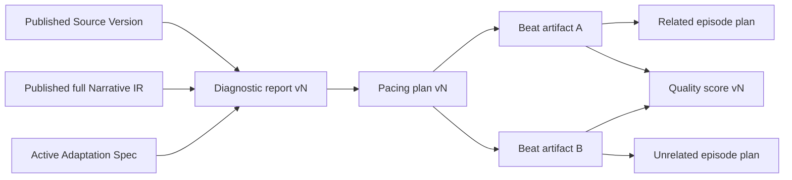

# 改编诊断、节奏模型与可解释质量评分

## 架构边界

本阶段没有建立第二套原著或计划真相源。分析输入固定为一个已发布的 `source_version_id`、一个当前已发布 full `ir_revision_id` 和可选的 active `adaptation_spec_version_id`。报告记录这些冻结 ID，artifact dependency 另行连接 source version、IR fact、story arc、spec、诊断、节奏计划、节拍与评分。原有 v1/v2、CMS 和 00–12 工作流不变。

数据库迁移 `13-adaptation-diagnostics-pacing-quality.sql` 只新增 artifact type、表、索引、触发器和迁移台账。报告、计划、评分及其证据子表禁止原地更新或删除；生成或编辑都创建父版本。由于 `operations.operation_type` 是冻结 CHECK，本阶段兼容复用 `spec_validation`，并在 `checkpoint_data.analysis_kind` 区分 `diagnosis`、`pacing`、`pacing_edit`、`quality_score` 和 `local_rescore`；失效扫描继续复用 `invalidation_scan`。

## 数据流与失效

人工修改 Beat A 时，新 pacing version 复用内容 hash 未变化的 Beat B artifact，为 Beat A 创建新 revision。失效遍历从旧 Beat A artifact 的显式下游边开始，因此 EP1 和它的下游 stale，EP2 保持 valid。操作、任务和每个 impact 都写入现有 operation/invalidation 表。

## 确定性分析

`cms/backend/internal/adaptationanalysis` 是无数据库、无网络的纯 Go 模块。相同冻结输入始终得到相同节点、节拍、问题和评分，不调用收费模型。规则检测连续低强度、信息过载、缺少钩子、高潮过晚和结尾无悬念；十个评分维度都至少产生一条带 evidence、location、severity、message、suggestion 的可解释记录，未发现缺陷时 severity 为 `info`。

`cms/backend/internal/store/v2_analysis.go` 负责事务、版本号、artifact 注册、依赖边、幂等重放和局部失效；n8n `04b` 只是轻量命令适配器，不承载分析算法。

## CMS 与确认门禁

项目详情的“改编诊断”页面展示诊断卡片、整季/单集曲线、节拍编辑器、节奏问题和评分详情。诊断可生成 Spec 草稿，草稿包含报告冻结的 source/IR、诊断章节范围和核心卖点规则；取消不会写库，明确确认后才调用既有 `POST /api/v2/adaptation-projects/{project_id}/specs` 创建不可变新版本。

## 验证

- `go test ./... -count=1`
- `npm test && npm run build`（`cms/frontend`）
- `python scripts/validate-phase1-json-schemas.py`
- `node scripts/validate-phase1.js`
- `scripts/validate-phase13-db.sh <临时数据库>` 验证迁移重复执行
- `TestPhase13MockE2EAndSelectiveBeatInvalidation` 在隔离 PostgreSQL 中覆盖 Source Version → IR → 诊断 → 节奏编辑 → 评分 → 确认 Spec，并断言仅关联计划 stale。

## 下一阶段接口预留

后续可在不改变本阶段契约的前提下增加异步付费分析 provider、按 artifact 的真实剧本/分镜评分、多人节拍冲突合并和诊断 Spec proposal 的服务端审批流。当前阶段没有启用这些能力，也不会自动启动后续生产。
