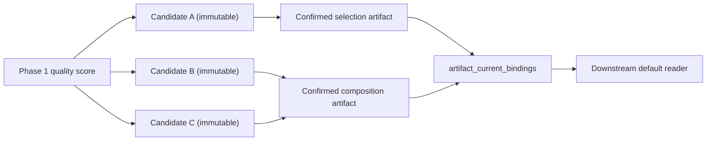

# 多候选生成、评分、人工择优与组合

## 边界

本阶段复用第一阶段的 `quality_score_reports`、统一 `artifacts` 和 `artifact_dependencies`，不建立平行的评分真相源，也不启动第三阶段。生成器只允许 `deterministic_mock`；`model`、`prompt_version`、`random_seed`、生成参数、父候选和派生原因仍完整保存，为后续接入真实 provider 保留可重放契约。

支持的目标与组件：

| 目标 | 候选组件 |
| --- | --- |
| 故事弧 | 分集方案 |
| 单集 | 开场、冲突推进、高潮、结尾钩子 |
| 场景 | 对白、动作、旁白 |
| 分镜 | 构图、景别、运镜、表演、转场 |
| 图片 | 关键图片 |
| 视频 | 视频镜头 |

## 版本与下游门禁

`candidate_sets`、`candidates`、`candidate_scores`、`candidate_selections`、组合部件和硬规则结果都有拒绝 UPDATE/DELETE 的触发器。收藏、取消收藏、淘汰和恢复是 `candidate_decisions` 的追加事件，不改候选。候选 artifact 固定为非 current，未选候选因此不会被下游默认读取。

选择或组合会在一个事务内：

1. 校验候选属于同一项目和候选集；
2. 读取不可变正文；
3. 运行五项硬规则；
4. 创建新的 `candidate_selection` artifact；
5. 从每个来源候选写 `candidate_selected_component` 依赖；
6. 将旧 current artifact 标记为 superseded 历史；
7. 原子更新唯一 `artifact_current_bindings`。

旧 artifact 正文和选择记录从不更新。幂等重放返回同一个选择/组合和 artifact。

## 评分与比较

`candidate_scores` 记录总分、忠实度、钩子、节奏、连续性、可拍摄性、预计时长、修改风险、推荐理由和扣分原因，并保存 `source_quality_score_report_id`。候选 artifact 通过 `candidate_quality_baseline` 显式依赖第一阶段评分 artifact。

文本候选保存 RFC 6902 风格的路径化结构 diff（`path/kind/before/after`）。图片/视频媒体地址使用候选内容中的 `media.preview_url`；CMS 分别提供图片并排/滑块入口，以及多视频同步时间和时间码评论。成本只是 `estimated_cost + currency` 展示字段，本阶段没有账单、扣费或结算表。

## 硬规则

跨候选组合和单候选选择都执行同一验证函数：

- `causality`：组合包含可执行叙事组件；
- `duration`：预计时长不超过基准的硬上限；
- `character_state`：无人物状态冲突；
- `foreshadowing`：伏笔引用与回收关系完整；
- `continuity`：场景、道具及时空连续。

五项结果全部落入 `candidate_hard_rule_results`。任一失败时事务不创建 artifact、不更新 current。

## API 与工作流

- `POST/GET /api/v2/adaptation-projects/{project_id}/candidate-sets`
- `GET /api/v2/adaptation-projects/{project_id}/candidate-sets/{candidate_set_id}`
- `POST .../{candidate_set_id}/selections`
- `POST .../{candidate_set_id}/compositions`
- `POST /api/v2/candidates/{candidate_id}/decisions`
- `POST /api/v2/candidates/{candidate_id}/timecode-comments`

所有 POST 要求 `Idempotency-Key`。选择和组合请求还要求 `confirmed=true`。`04c-multi-candidate-generation.json` 是 inactive 的轻量 API 适配器，不在 n8n Code 节点复制领域算法。

## 验证

- Go：确定性三候选、排序解释、结构化 diff、五项硬规则、API 确认门禁；
- PostgreSQL E2E：幂等生成、旧版本保留、跨候选组合全部硬规则、只有选中 artifact 进入 current；
- 前端：请求归一化、评分筛选、A/B/C 组件组合、硬规则展示与生产构建；
- 静态：`node scripts/validate-phase14.js` 和全量 workflow JSON/连线检查；
- 迁移：`14-multi-candidate-selection.sql` 重复执行由迁移 checksum 安全 no-op。

本阶段到此结束，不包含真实多模型竞价、商业结算或第三阶段能力。
> Current closure (migrations 21/24): production generation and independent
> review require explicitly configured real providers. `deterministic_mock` is
> registered only in a test process with
> `CANDIDATE_ENABLE_DETERMINISTIC_MOCK=true`. Statements below that describe a
> mock-only generator are retained as the historical migration-14 baseline.
