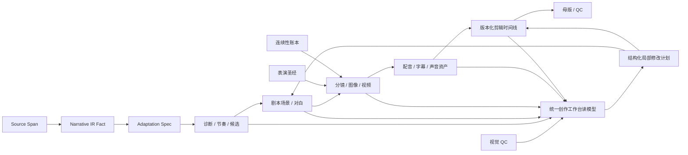

# 第五阶段架构：口型、声音、类型化剪辑与统一创作工作台

## 目标与边界

第五阶段将前四阶段已经存在的诊断、节奏、候选、剧本/分镜、局部修改、表演圣经、连续性和视觉 QC 组合为一个后期制作读写面。它不复制这些实体，也不另建项目、单集、角色、场景、台词或镜头 ID。新增表只保存后期制作特有的版本、绑定、检测结果和来源引用。

本阶段不调用收费模型。完整演示使用确定性 Mock 资产和 PostgreSQL fixture；真实生产可在相同合同后替换口型分析器、声音供应商和渲染执行器。

## 统一数据关系

`GET /api/v1/projects/{project_id}/episodes/{episode_id}/creative-workbench` 是组合读模型。它返回既有实体的原始 ID，并聚合诊断、节拍、候选、场景、对白、镜头、时间记录、声音 cue、时间线、表演圣经、连续性问题、质量问题、评论和版本绑定。它不是新的事实来源。

## 口型与对白时间

`dialogue_timing_versions` 逐句保存说话人、开始/结束时间、音频时长、目标口型区间、画面可见人物、检测到的说话人、检测口型区间、置信度和分析器版本。`dialogue_timing_issues` 保存可跳转的精确问题位置。

后端 `postproduction.ValidateDialogueTimings` 检测：

- 结束时间不晚于开始时间、音频或口型区间无效；
- 说话人未出现在画面或检测到的人物与说话人不一致；
- 音频和目标口型区间的起止偏差超出容差；
- 配音超出对白或镜头可用区间；
- 同一轮次中多人对白顺序错误或非预期重叠。

配音过长时按风险顺序给出压缩文案、调整停顿、延长镜头以及有限变速建议。媒体 worker 只接受 `0.80–1.12` 倍的对白/旁白速度，超过 `1.12` 会拒绝执行，因此不能用过度加速掩盖内容时长问题。

对白文字或生产模式改变仍走第三阶段 `change-plan.v1` 的确认/执行事务。执行后创建新的对白实体版本、音频版本、字幕 cue 版本和时间线版本，只克隆命中时间区间，旧版本保持可追溯。

## 正式声音资产

迁移 17 新增声音资产、资产版本、cue 版本和整集风格替换记录。声音类型包括 BGM、环境声、常规音效、脚步、门响和打斗；原 `bgm_hint`、`sound_effect_hint` 在工作流 17 中转成正式任务，而不再是无人负责的提示字段。

每个声音版本保存：

- 来源 URI、供应商、内容哈希和版本；
- 情绪、BPM、拍号、调性、时长和风格组；
- 授权类型、授权方、授权凭证 URI、地域和有效期；
- 审批状态及前驱版本。

cue 保存画面事件时间码、淡入淡出、卡点、转调、对白 ducking、增益和目标轨道。整集声音风格替换为每个当前 cue 选择目标风格组的后继资产版本，建立新 cue 和新时间线；原资产、cue、时间线及授权记录不变。

媒体 worker 支持 BGM 淡入淡出、显式半音转调、可配置 ducking 和有限对白变速。转调只在 manifest 明确指定时执行，不自动猜测音乐调性。

## 类型化剪辑模板

系统种子模板包括都市爽剧、情感剧、悬疑剧、喜剧和动作剧。模板版本控制：

- 平均镜头长度；
- 快切与反应镜头比例；
- 转场类型；
- 字幕样式和密度；
- BGM、环境声与音效密度；
- 特写、停顿、重复强调和节拍策略。

模板本体、模板版本和应用绑定分开保存。项目级绑定提供默认值，单集级绑定优先；两级都允许 JSON 合同范围内的覆盖配置。每次应用都克隆当前时间线为后继版本并记录模板版本、覆盖值、操作者和原因，不修改模板或来源时间线。

## 统一工作台与局部修改

Vue 工作台路由为 `/projects/:projectId/episodes/:episodeId/workbench`。页面包含：

- 可拖拽场景卡和剧情节拍时间轴；
- 逐句对白编辑、对白转旁白/动作；
- 分镜缩略图、拆分/合并/换序计划和镜头时长调整；
- 口型、说话人和多人轮次校验；
- BGM、环境声、音效、配音、字幕和画面多轨时间线；
- 模板应用、整集声音风格替换；
- 候选、时间线版本、比较和恢复入口；
- 表演圣经、连续性、视觉 QC 和综合质量问题；
- 绑定台词、镜头、场景或时间码的评论；
- 从任何问题跳转编辑位置或创建局部修改计划。

场景换序、镜头结构和剧本修改先生成结构化计划；用户确认前不会写正式数据。当前镜头拆分/合并动作以局部修改计划表达，并沿既有确认/执行门禁物化，不绕过版本、连续性或首尾帧约束。

## 版本、恢复与不可变历史

`edit_timelines` 增加父时间线、版本号、模板版本、审批状态和 current 标记。数据库触发器禁止修改已批准的对白时间、声音、模板和工作台快照。恢复旧时间线不是回写旧记录，而是从选定版本创建新的 `restored` current 版本。

项目级/单集模板覆盖、声音风格替换、对白修改和恢复都写人工原因或 `human_edit` 事件。`artifact_provenance` 将产物关联到 Source Span、IR Fact、Adaptation Spec、Prompt/模型版本和人工修改记录；`artifact_dependencies` 决定哪些后继产物需要 stale 或重建。

## 精确重建

局部对白修改以当前字幕/音频的毫秒区间为边界。重建目标只有：

1. 对应对白音频；
2. 对应字幕 cue；
3. 引用该对白的镜头区间；
4. 当前剪辑时间线中的对应区间。

其他场景、镜头、声音 cue 和时间线片段复用原版本。事务失败时不会留下半个 current 版本。模板切换或整集声音替换属于明确的整集操作，因此创建整集后继时间线，但仍复用未改变的媒体资产。

## 接口与合同

- OpenAPI：`contracts/openapi/post-production-api.v1.yaml`
- JSON Schema：
  - `dialogue-timing.v1.json`
  - `sound-asset.v1.json`
  - `editing-template.v1.json`
  - `creative-workspace.v1.json`
- 工作流：`workflows/17-post-production-creative-workbench.json`
- 数据库：`database/17-post-production-creative-workbench.sql`
- 媒体 manifest：`scripts/media-worker/manifest.schema.json`

所有写操作仍受现有认证、项目隔离、事务和局部修改确认门禁约束。
